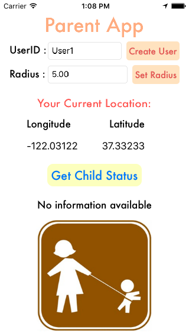
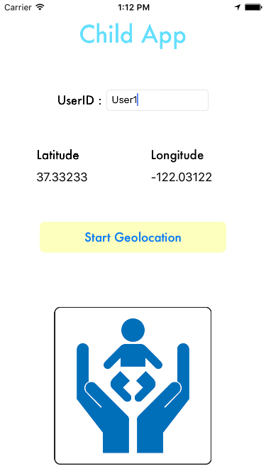
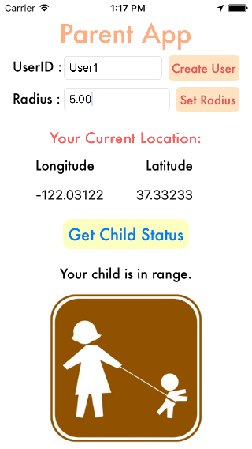

# Digital Leash

Digital Leash allows a parent to set up a geo-fencing monitor for their child. The parent sets a point and a radius which the child is supposed to stay in. If the child moves out of that area, the parent is notified.

- Digital Leash is comprised of two apps: one for the parent and one for the child
- The parent app allows user to create a username and set a radius for their child. The user then gets a response of whether the child is in range
- The child app signs in with parent's username and reports child's GPS location
- This project required use of NSURLConnection (which is deprecated in iOS 9)
- GPS locations saved to [Heroku](http://protected-wildwood-8664.herokuapp.com/) backend

## Requirements

- iOS 8.0+ / Mac OS X 10.9+
- Xcode 7.3+

## Frameworks used

- Core Location
- UIKit

## License

Digital Leash is released under the MIT license. See LICENSE for details.